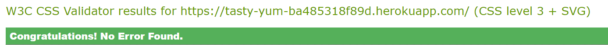

# **TastyYum Foodblog**
TastyYum is a web application designed for food enthusiasts to explore, share, and manage delicious recipes from around the world. Users can browse a wide variety of recipes, view details, and engage with the community by commenting and rating recipes.

[View live website here](https://tasty-yum-ba485318f89d.herokuapp.com/)

# Table of Content

* [**Project**](<#project>)
    * [Objective](<#objective>)
    * [Site Users Goal](<#site-users-goal>)
    * [Site Owners Goal](<#site-owners-goal>)
  
* [**User Experience (UX)**](<#user-experience-ux>)
    * [Wireframes](<#wireframes>)
    * [User Stories](<#user-stories>)
    * [Site Structure](<#site-structure>)
    * [Design Choices](<#design-choices>)

* [**Existing Features**](<#existing-features>)
    * [Home page](<#home-page>)
    * [Sign Up](<#sign-up>)
    * [log In](<#sign-in>)
    * [log Out](<#sign-out>)
    * [Footer](<#footer>)  

* [**Features Left To Implement**](<#features-left-to-implement>)

* [**Technologies Used**](<#technologies-used>)
    * [Languages](<#languages>)
    * [Frameworks & Software](<#frameworks--software>)
    * [Libraries](<#libraries>)

* [**Testing**](<#testing>)
    * [Testing User Stories](<#testing-user-stories>)
    * [Code Validation](<#code-validation>)
    * [Additional Testing](<#additional-testing>)
    * [Known Bugs](<#known-bugs>)
* [Deployment](<#deployment>)
* [Credits](<#credits>)
* [Acknowledgements](<#acknowledgements>)

# **Project**

## Objective
As a food lover, I created this app to provide a community-driven platform where food enthusiasts can explore, share, and interact with recipes from various cuisines around the world. By facilitating a space for users to post recipes, rate dishes, leave comments, and offer feedback.

## Site Users Goal
The goal of the users is to discover a variety of recipes to try at home, ranging from everyday meals to special dishes from around the world.

## Site Owners Goal
The goal of the site owner of TastyYum is to ensure the platform's growth, user satisfaction, and overall success by encouraging active participation through recipe sharing, commenting, and voting.

### Database Schema
The database model used for this project is shown below and it was created using [Lucidchart](https://lucid.app/lucidchart/)

[Back to top](<#table-of-content>)

# **User Experience (UX)**

## Wireframes
The wireframes for the site were created in the software [Balsamiq](https://balsamiq.com). The wireframes have been created for desktop, tablet and mobile devices. The text content wasn't finalized during the wireframe process. It's worth mentioning that there are visual differences compared to the wireframes, the reason being design choices that was made during the creation process.

<b>Wireframes</b>

 

## 👤 User Stories
Below the user stories for the project are listed to clarify why particular feature matters.

### Site User
|  | | |
|:-------:|:--------|:--------|
| As a Site User | I want to be able to browse recipes and read instructions without needing to log in, so that I can get a feel for the site before registering | &check; |
| As a Site User | I want to create an account, so that I can save my favorite recipes and interact with the community | &check; |
| As a Site User | I want to log in securely, so that I can ask questions, share tips, or leave feedback for other users | &check; |
| As a Site User | I want to log out, so that my account stays secure | &check; |
| As a Site User | I want to browse a list of recipes, so that I can explore different dishes | &check; |
| As a Site User | I want to see the full details of a recipe, so that I can follow the instructions to cook it | &check; |
| As a Site User | I want to submit a new recipe, so that I can share it with others.
| As a Site User | I want to filter recipes by category, so that I can easily find recipes that interest me | &check; |
| As a Site User | I want to leave a comment on a recipe, so that I can share my feedback or ask questions | &check; |
| As a Site User | I want to browse recipes comfortably, so that I can use the website on my phone | &check; |
| As a Site User | I want the interface to be fully responsive, so that I can comfortably browse and read recipes on a smaller screen | &check; |

### Site Admin

|  | | |
|:-------:|:--------|:--------|
| As a Site Admin | I can log out from the site so that I can feel safe that nobody can access my information | &check; |
| As a Site Admin | I want to enforce secure login methods, so that user data remains protected  | &check; |
| As a Site Admin | I want to view a list of all registered users, so that I can manage the community and remove unwanted users if necessary  | &check; |
| As a Site Admin | I want to delete offensive or spam comments, so that the site remains a positive and respectful space  | &check; |
| As a Site Admin | I want to create and organize recipe categories, so that users can easily find relevant recipes  | &check; |
| As a Site Admin | I want the ability to moderate user-generated content, so that I can ensure recipes and comments meet quality and community guidelines.
| As a Site Admin | I want to track site traffic and user activity, so that I can improve engagement and optimize content.
| As a Site Admin | I want analytics on recipe views, user engagement, and popular content, so that I can make data-driven decisions to improve the site

[Back to top](<#table-of-content>)

## Site Structure
The TastyYum website follows a structured layout for easy navigation and user experience. Below is the breakdown of the site's structure:

### **Home page**
Users can navigate through the page here

<b>Home page</b>

 

### **Views recipes and add comments**
 Users can view recipes but they cannot comment on recipes unless they are logged in.

<b>View recipe and add comment page</b></b>

 

### **Sign Up**
New users can create an account from the Signup page.

<b>Sign Up</b>

 

### **Log in**
Users can login from the Login page.

<b>Log in</b>

 

### **Admin Area**
This page gives the administrator a view with information about i.e. total number of users, number of comments and number of posts. In this view the administrator also can add new recipes, categories the recipes, add and delete comments.

<b>Admin Area</b>

 

### Features Left to Implement
* Add functionalities to llow users to view and edit their profiles, including changing their passwords and updating personal information.
* Allow users to edit their submitted recipes.
* Implement functionality for users to delete their recipes.
* Enable users to reply to other users’ comments, creating a threaded discussion.
* Add funtion to allow user search for recipes

[Back to top](<#table-of-content>)

# Testing

## Code Validation
The code on the 'TastyYum' site has been tested through W3C Markup Validation Service, W3C CSS Validation Service and JSHint. Errors were at first found on the site in the W3C Markup Validation Service but could quite easily be fixed (see bugs section). One error appeared as well in the W3C CSS Validation but that was connected to Font Awesome and not to the site code itself (see bugs section).

### Markup Validation
After fixing the inital errors that W3C Markup Validation Service reported, no errors were returned.

<b>HTML Validation Result</b>

 

[Back to top](<#table-of-content>)
## Languages

### CSS Validaton
When validating my own code the W3C CSS Validator reports no errors.

<b>CSS Validation Result</b>

 

[Back to top](<#table-of-content>)

### Browser Compatibility
* Google Chrome Version (106.0.5249.119)
* Mozilla Firefox (version 105.0.3)
* Min (version 1.26.0)
* Apple Safari (version 16.0)
* Microsoft Edge (version 106.0.1370.47)

[Back to top](<#table-of-content>)

### Lighthouse
Google Lighthouse in Chrome Developer Tools was used to test the application within the areas of *Performance*, *Accessibility*, *Best Practices* and *SEO*. I tested the *index page*, *review details page*, *the admin area* and *the about page*. The testing showed the following:

* Index Page - Performance: 75, Accessibility: 100, Best Practises: 100, SEO: 92

<b>Lighthouse Result</b>

 

* [Python](https://en.wikipedia.org/wiki/Python_(programming_language)) - Provides the functionality for the site.
* [HTML5](https://en.wikipedia.org/wiki/HTML) - Provides the content and structure for the website.
* [CSS3](https://en.wikipedia.org/wiki/CSS) - Provides the styling for the website.
* [JavaScript](https://en.wikipedia.org/wiki/JavaScript) - Provides interactive elements of the website

## Frameworks & Software
* [Bootstrap](https://getbootstrap.com/) - A CSS framework that helps building solid, responsive, mobile-first sites
* [Django](https://www.djangoproject.com/) - A model-view-template framework used to create the Review | Alliance site
* [Balsamiq](https://balsamiq.com/) - Used to create the wireframe.
* [Microsoft Excel](https://www.microsoft.com/sv-se/microsoft-365/excel) - Used to create testing scenarios.
* [Github](https://github.com/) - Used to host and edit the website.
* [GitBash](https://en.wikipedia.org/wiki/Bash_(Unix_shell)) - Terminal in [Gitpod](https://www.gitpod.io) used to push changes to the GitHub repository.
* [Heroku](https://en.wikipedia.org/wiki/Heroku) - A cloud platform that the application is deployed to.
* [Lighthouse](https://developer.chrome.com/docs/lighthouse/overview/) - Used to test performance of site.
* [Responsive Design Checker](https://ui.dev/amiresponsive) - Used for responsiveness check.
* [Favicon](https://favicon.io/) - Used to create the favicon.
* [Gitpod](https://gitpod.io/)- Used to create and edit this website.
* [Cloudinary](https://cloudinary.com/) - A service that hosts all static files in the project.
* [HTML Validation](https://validator.w3.org/) - Used to validate HTML code
* [CSS Validation](https://jigsaw.w3.org/css-validator/) - Used to validate CSS code
* [PEP8 Validation](http://pep8online.com/) - 
* [JSHint Validation](https://jshint.com/) - Used to validate JavaScript code
* [Google Chrome DevTools](https://developer.chrome.com/docs/devtools/) - Used to debug and test responsiveness.

[Back to top](<#table-of-content>)

#### 📦 Local Deployment  
1. Clone the repository from GitHub by clicking the "Code" button and copying the URL.
2. Open your preferred IDE and open a terminal session in the directory you want to clone the repository to.
3. Type `git clone` followed by the URL you copied in step 1 and press enter.
4. Install the required dependencies by typing `pip install -r requirements.txt` in the terminal.
5. Note: The project is setup to use environment variables. You will need to set these up in your local environment. See [Environment Variables](#environment-variables) for more information.
6. Connect your database of choice and run the migrations by typing `python manage.py migrate` in the terminal.
7. Create a superuser by typing `python manage.py createsuperuser` in the terminal and following the prompts.
8. Optional: Fixtures for Flight, Airport and Aircraft models are included in the project in the `fixtures` directory. To add pre-populated data to the database, run `python manage.py loaddata fixtures/[fixture_name].json`.
9. Run the app by typing `python manage.py runserver` in the terminal and opening the URL in your browser.

#### 💜 Heroku Deployment
1. Login to the Heroku dashboard and create a new app.
2. Connect your GitHub repository to your Heroku app.
3. In the Settings tab, ensure that the Python Buildpack is added.
4. Set environment variables in the Config Vars section of the Settings tab.
5. In the Deploy tab, enable automatic deploys from your GitHub repository.
6. Click the "Deploy Branch" button to deploy the app.
7. Once the app has been deployed, click the "Open App" button to view the app.
8. If using S3, you will need to set up an S3 bucket and add the environment variables to your Heroku app (see tutorial [here](https://testdriven.io/blog/storing-django-static-and-media-files-on-amazon-s3/) for reference.)

[Back to top](<#table-of-content>)

#### 📐 Environment Variables
- For local deployment, you will need to create a `.env` file in the root directory of the project and set the environment variables in this file.
- For Heroku deployment, you will need to set the environment variables through the Heroku CLI or through the Heroku dashboard under 'Config Vars'.
- You need to define the following variables:
  - If using a Postgres database:
    - `DATABASE_URL` - the URL for your Postgres database.
    - `NAME` - the name of your database.
    - `USER` - the username for your database.
    - `PASSWORD` - the password for your database.
    - `HOST` - the host for your database.
    - `PORT` - the port for your database.
  - Django settings:
    - `SECRET_KEY` - the secret key for your Django project.
    - `DEBUG` - set to `True` for development, `False` for production.
  

  
 
 
 

---

# 👋 Credits

[Favicon.io](https://favicon.io/) - used to create favicon.
[pexels.com](https://www.pexels.com/)- used to generate all the images

[Back to top](<#table-of-content>)